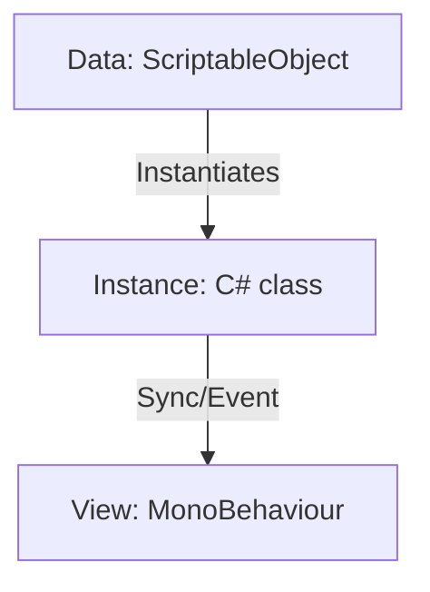

# 🏛️ 은혜 및 상태 이상 시스템 기술 설계 (Boon Architecture)

이 문서는 `Pluto` 프로젝트의 **인스턴스 기반(Instance-based)** 은혜 및 상태 이상 시스템의 기술적 구조와 데이터 흐름을 정의합니다.

---

## 1. 아키텍처 핵심 모델: Data-Instance-View (DIV)
데이터의 불변성(Immutability), 상태의 가변성(Volatility), 그리고 시각적 표현(Visualization)을 분리하여 관리합니다.

### [Data] BoonData & StatusEffectData (ScriptableObject)
- **역할:** 은혜와 상태 이상의 '설계도(붕어빵 틀)'. 에디터에서 기획자가 작성하는 에셋.
- **특징:** 게임 실행 중 수치가 절대 변하지 않음 (Read-only). 레벨업 공식이나 기본 이펙트 프리팹 정보를 보유.

### [Instance] BoonInstance & StatusInstance (C# Class)
- **역할:** 플레이어나 적이 실제로 소유한 '객체(붕어빵)'.
- **특징:** 런타임에 동적으로 생성되며, 현재 레벨(`CurrentLevel`), 남은 지속시간(`RemainingTime`), 현재 중첩수(`Stacks`) 등의 **상태**를 가짐.

### [View] BoonIconView & EffectSpawner (MonoBehaviour)
- **역할:** 인스턴스의 상태를 플레이어에게 보여주는 **시각적 창구**.
- **특징:** 인벤토리 UI의 아이콘, 적 머리 위의 상태 이상 이펙트, 타격 시 파티클 등을 담당.

---

## 2. 동적 능력치 파이프라인 (Extra Attributes)
`StatType` 열거형의 무분별한 확장을 방지하기 위해 **태그 기반의 유연한 스탯** 방식을 사용합니다.

### StatHandler의 구조
- **Core Stats:** `Enum` 방식. 자주 사용되고 모든 캐릭터에게 필수적인 수치 (HP, Speed, Atk).
- **Extra Attributes:** `Dictionary<string, float>` 방식. 은혜나 특종 아이템에 의해서만 생기는 유동적 수치.

---

## 3. 실전 적용 사례 (Case Studies)

### Case A: 제우스 공격 은혜 (Zeus Attack Boon)
*   **Data (`BoonData` SO)**: "기본(Common Base) 데미지는 `20`이며, 하데스 표준 성장 공식을 따른다." (불변)
*   **Instance (`BoonInstance` Class)**:
    *   플레이어가 '석류'를 먹어 **레벨 2**가 됨.
    *   신규 공식 적용: `FinalDamage = 20 (Base) + 16 (Base의 80%) = 36`.
    *   **결과:** 이 플레이어의 은혜만 `36`의 데미지를 내며, 다음 레벨업 시 `36 + 12 (Base의 60%) = 48`이 됨.

---

마지막 업데이트: 2026-03-31
